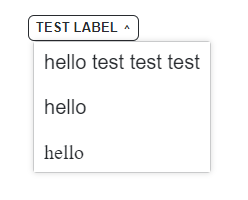

# Accessible Dropdown Menu

[live Example - _external site_](https://dropdown-a11y.netlify.app/)

## Contents

- [Intro](#intro)
- [Installation](#installation)
- [About](#about)
- [Examples](#examples)
- [Variants](#variants)
- [functionality](#functionality)
  - [Keyboard](#keyboard)
- [todo](#todo)

## Intro

There are a lot of dropdowns that are not accessible to screen readers

This can be due to any number of things but commonly will be:

- Incorrect use of Aria
- Keyboard navigation controls that either are non-standard or trap the user.
- Non-visible focus states
- Use of non semantic Elements

<details>
<summary><i>📖 Awesome resources to learn more about accessible dropdowns and what needs to be covered</i>
</summary>

- [Smashing magazine article](https://www.smashingmagazine.com/2017/11/building-accessible-menu-systems/) - _*Heydon Pickering*_ (_external link_)
- [W3C Authoring practices](https://w3c.github.io/aria-practices/examples/disclosure/disclosure-navigation.html) (_external link_)
- [CSS only Dropdowns](https://moderncss.dev/css-only-accessible-dropdown-navigation-menu/) - _*Stephanie Eckles*_ (_external link_)

</details>

## Installation

This application is created wih React. If you would like to setup this Application on your personal machine these are the steps required.

<details>
<summary>Instructions</summary>

- fork and clone the Repo
- navigate into the Dropdown repo
- npm install
- npm run start will open the example component on port 3000: [localhost:3000 ](http://localhost:3000/) _external site_

</details>

---

## About

The App is a compound component. The state is passed from the **parent** `<Dropdown>` ⬇️
to the **children** 🚸:

- `<Trigger>`
- `<Content>`
- `<Item>`

The dropdown menu is unstyled except for the initial dropdown functionality.

⚠️ _*Further styling is required to personalise the dropdown/ ensure colour contrast for the site it will be used on.*_

Each component can accept props (classNames, functions, atttributes etc), and a variant (_*currently only default available*_).

- Written in React & Typescript with Functional Components
- State shared using Context
- Functionality hidden from developer to make easy to implement

---

## Examples

<details>
<summary> Example Code for menu</summary>

```jsx
<Dropdown>
  <Dropdown.Trigger variant="default">Menu</Dropdown.Trigger>
  <Dropdown.Content>
    <Dropdown.Item>
      <button>hello</button>
    </Dropdown.Item>
    <Dropdown.Item>
      <a href="/#">world</a>
    </Dropdown.Item>
    <Dropdown.Item>
      <p>hello</p>
    </Dropdown.Item>
  </Dropdown.Content>
</Dropdown>
```

</details>

---

### Variants


<br /><br />

**default**: basic styling added to the component.

- White background
- Grey border
- Hover/ Focus/ Active states


<br /><br />

<p><span style="font-size: 2.5rem; font-weight: bold">Work in Progress</span> more to come!</p>

---

## Functionality

### Keyboard

Each focusable child passed to Dropdown. Item can be programmatically focused using the keyboard once the menu has been opened.
focusable children include:

- `<a>` - must have a href
- `<button>`
- `input`
- `<textarea>`
- `<select>`
- `<details>`
- any other element you have added a tabindex to that is not -1

> **Note:** All elements listed above will have `tabindex={-1}` added to it for management of focus state

## TODO

- Tests
- Add submenu functionality
- Detect menu collision with edge of Window - move appropriately to remain in view
- Add to NPM
- Additional Variants
